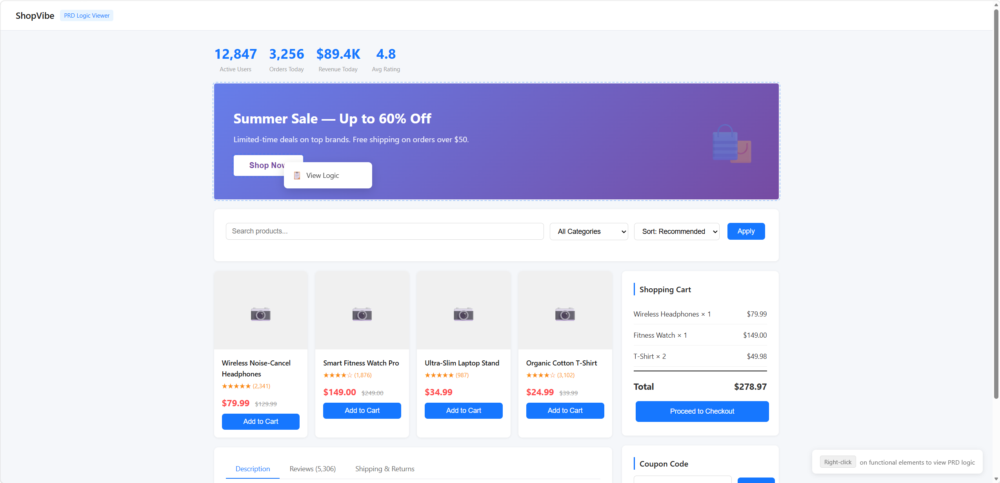
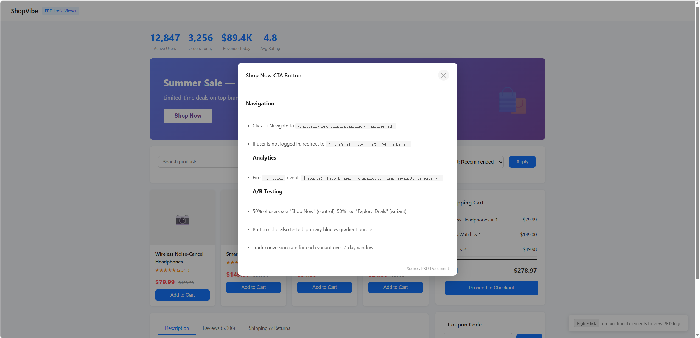

# PRD Logic Viewer / PRD逻辑穿透

> Bridge the gap between prototype demos and PRD — right-click any element to view its logic description.

[](https://opensource.org/licenses/MIT)

🇨🇳 [中文说明](#中文说明) | 🇬🇧 [English](#english)

---

## 🎯 Live Preview

👉 [在线预览 Prototype 页面](https://konaldowu.github.io/prd-logic-viewer/prototype.html) — 右键任意功能元素查看 PRD 逻辑描述

<!-- 截图位置：将截图文件放入仓库后替换下方占位符 -->


---

## 中文说明

### 痛点

AI 生成原型 demo 很直观，但具体业务逻辑还得回 PRD 里翻找——来回切换文档，效率低且容易遗漏。

### 做了什么

在原型 HTML 中，对任何功能元素**右键 → 查看逻辑**，即可弹出弹窗展示该模块在 PRD 中的逻辑描述文本。不用再切文档了。

### 两种模式

| 模式 | 说明 |
|------|------|
| **从 PRD 生成原型** | 解析 PRD 文档，提取功能模块和逻辑，生成带右键菜单的完整交互原型 |
| **往已有原型注入** | 给现有原型 HTML 注入右键"查看逻辑"功能，匹配 PRD 逻辑到对应元素 |

### 支持的 PRD 格式

- Markdown (.md)
- Word (.docx)
- 飞书文档
- 直接粘贴文本

### 交互设计

- 🖱️ 功能元素右键 → 弹出"📋 查看逻辑"菜单
- 📋 点击后弹出模态弹窗，展示模块名称 + PRD 逻辑描述
- ✨ 带 `data-logic-id` 的元素 hover 时显示浅色虚线边框提示
- ⌨️ 支持 ESC 键 / 点击遮罩关闭弹窗
- 📝 弹窗内支持简易 Markdown 渲染（标题、加粗、列表、行内代码）

### 输出产物

- 单个自包含 HTML 文件（内联 CSS + JS）
- 浏览器直接打开，无需额外依赖

### 快速开始

直接在 AI Agent 工具中使用，将 `SKILL.md` 作为技能文件导入即可调用。

手动使用：

1. 将 `templates/prototype.html` 作为基础模板
2. 在功能元素上添加 `data-logic-id` 属性
3. 在 `logicData` 对象中配置模块 ID → 逻辑文本映射
4. 浏览器打开即可使用

```html
<!-- 标记功能元素 -->
<button class="proto-btn primary" data-logic-id="btn_submit">提交</button>

<!-- 配置逻辑数据 -->
<script>
const logicData = {
  "btn_submit": {
    name: "提交按钮",
    logic: "点击后校验必填项，校验通过则调用 `/api/submit` 接口..."
  }
};
</script>
```

---

## English

### The Problem

AI-generated prototype demos are intuitive, but finding the specific business logic still requires going back to the PRD — constant context switching is inefficient and error-prone.

### What It Does

**Right-click any functional element → "View Logic"** to see its PRD logic description in a popup. No more switching between documents.

### Two Modes

| Mode | Description |
|------|-------------|
| **Generate from PRD** | Parse PRD, extract modules & logic, generate interactive prototype with right-click menu |
| **Inject into existing prototype** | Add right-click "View Logic" functionality to an existing HTML prototype |

### Supported PRD Formats

Markdown, Word (.docx), Feishu Docs, or plain text paste.

### Output

- Single self-contained HTML file (inline CSS + JS)
- Open in browser, no dependencies required

### Quick Start

Import `SKILL.md` as a skill file in your AI Agent tool to use directly.

Manual usage:

1. Use `templates/prototype.html` as the base template
2. Add `data-logic-id` attributes to functional elements
3. Configure module ID → logic text mapping in the `logicData` object
4. Open in browser

```html
<!-- Mark functional elements -->
<button class="proto-btn primary" data-logic-id="btn_submit">Submit</button>

<!-- Configure logic data -->
<script>
const logicData = {
  "btn_submit": {
    name: "Submit Button",
    logic: "Validates required fields on click, then calls `/api/submit`..."
  }
};
</script>
```

---

## File Structure

```
├── SKILL.md                    # Skill definition (self-contained, Chinese)
├── SKILL_EN.md                 # Skill definition (self-contained, English)
├── templates/
│   └── prototype.html          # Base HTML template
├── README.md                   # This file
└── LICENSE                     # MIT License
```

## License

[MIT](./LICENSE)

---


